# 003 — 사용자 흐름 & 유저 스토리 (User Flow & Stories)

> **최종 수정:** 2026-03-26 (v1.2.0 반영)
> **상태 범례:** ✅ 구현 완료 · 🚧 프로토타입 구현 · 📋 계획됨
> **변경 이력:** v1.2.0 — UF-B2 폴더 생성 진입 경로 추가, UF-B8 DAG 내비게이션으로 업데이트, UF-B10 폴더 관리 신규, UF-B11 그래프 뷰 탐색 신규

---

## Part A. 에디터 사용자 흐름 ✅

### UF-A1. 문서 편집 플로우

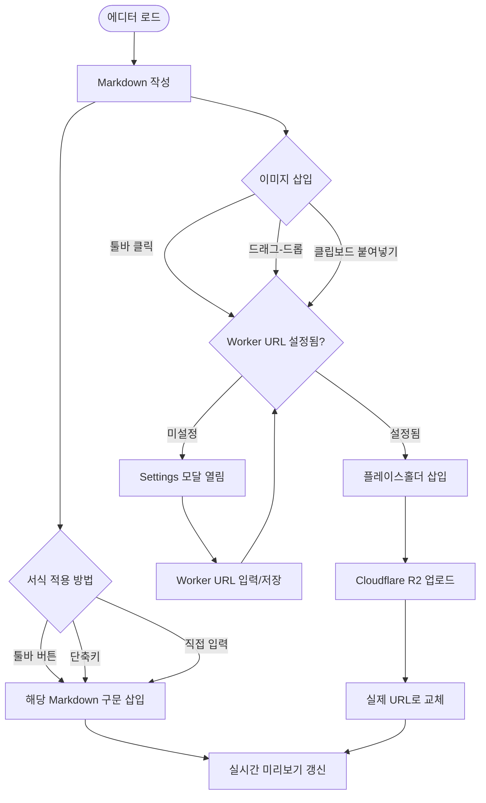

### UF-A2. 레이아웃 전환 플로우

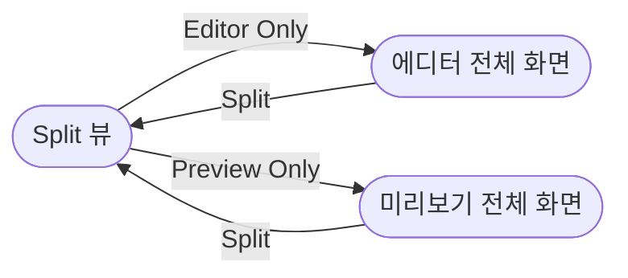

---

## Part A. 에디터 유저 스토리 ✅

### Epic 1: 텍스트 편집

#### US-01 — 자유 텍스트 입력 ✅
**As a** 작성자, **I want to** 에디터에 마크다운 원문을 직접 입력하고 싶다, **So that** 원하는 형식의 문서를 자유롭게 작성할 수 있다.

- [x] CodeMirror 6 기반 텍스트 입력 영역
- [x] 입력 즉시 반영, 대용량 문서에서도 입력 지연 없음
- [x] Markdown 구문 하이라이팅

#### US-02 — 서식 적용 (선택 텍스트) ✅
**As a** 작성자, **I want to** 텍스트 선택 후 툴바 버튼을 클릭하고 싶다, **So that** 선택한 텍스트에만 서식이 적용된다.

- [x] 선택 상태에서 Bold → `**선택 텍스트**`
- [x] 선택 없을 시 플레이스홀더 삽입
- [x] H1~H6, Bold, Italic, Strikethrough, Code, Link, Image 등 모든 서식

#### US-03 — Markdown 구문 삽입 ✅
**As a** 작성자, **I want to** 툴바에서 다양한 구문 버튼을 클릭하고 싶다, **So that** Markdown 문법을 외우지 않아도 된다.

- [x] Heading 1~6, Bold, Italic, Strikethrough
- [x] Blockquote, Unordered/Ordered/Task List
- [x] Inline Code, Code Block, Link, Image, Table, HR
- [x] Math Inline, Math Block (KaTeX)

---

### Epic 2: 실시간 미리보기

#### US-04 — 미리보기 동기화 ✅
**As a** 작성자, **I want to** 편집 시 미리보기가 즉시 갱신되길 원한다, **So that** 렌더링 결과를 확인하면서 글을 작성할 수 있다.

- [x] 텍스트 변경 시 미리보기 즉시 갱신
- [x] 에디터 ↔ 미리보기 스크롤 동기화

#### US-05 — 레이아웃 전환 ✅
**As a** 작성자, **I want to** Split / Editor Only / Preview Only를 전환하고 싶다, **So that** 상황에 따라 화면을 효율적으로 사용할 수 있다.

- [x] 3종 레이아웃 전환 버튼
- [x] 숨김 시 해당 패널 미렌더링

#### US-06 — 테마 전환 ✅
**As a** 사용자, **I want to** 라이트/다크 테마를 전환하고 싶다, **So that** 선호하는 환경에서 편집할 수 있다.

- [x] 툴바 테마 토글 버튼
- [x] 에디터 + 미리보기 동시 테마 전환

---

### Epic 3: 이미지 업로드

#### US-07 — 이미지 업로드 ✅
**As a** 작성자, **I want to** 이미지를 드래그-드롭이나 붙여넣기로 삽입하고 싶다, **So that** URL을 수동 입력하지 않아도 된다.

- [x] Cloudflare R2 Workers 기반 업로드
- [x] 드래그-드롭, 클립보드 붙여넣기, 버튼 클릭
- [x] 업로드 중 플레이스홀더 → 완료 시 URL 교체
- [x] `onImageUpload` prop으로 커스텀 업로더 지원

---

## Part B. KMS 사용자 흐름 (📋 계획됨)

### UF-B1. 신규 사용자 온보딩

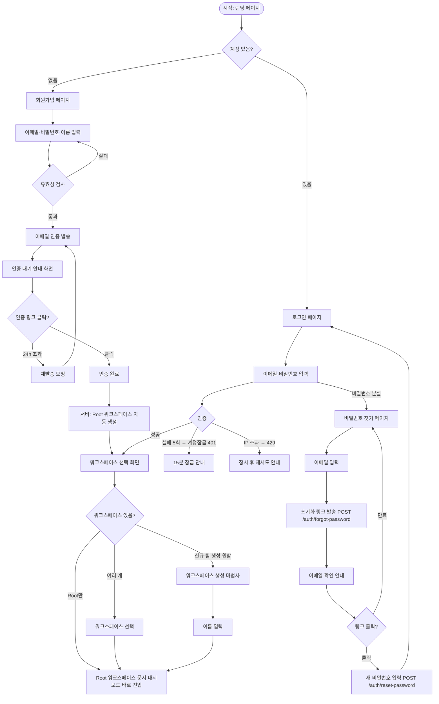

---

### UF-B2. 문서 작성 전체 플로우 (v1.2.0 — 폴더 진입 경로 추가)

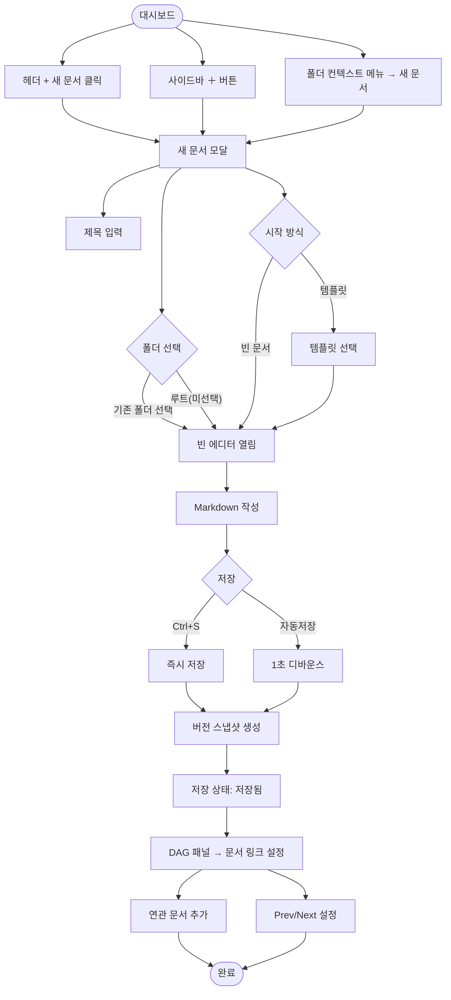

---

### UF-B3. 팀원 초대 및 협업

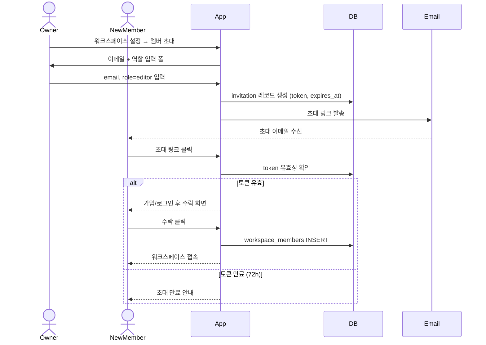

---

### UF-B4. 문서 검색

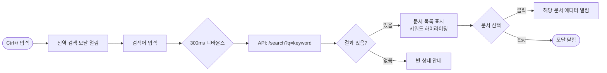

---

### UF-B5. CSS 테마 변경

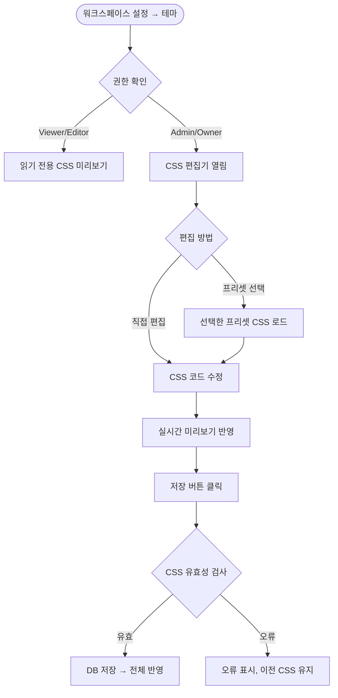

---

### UF-B6. Import / Export

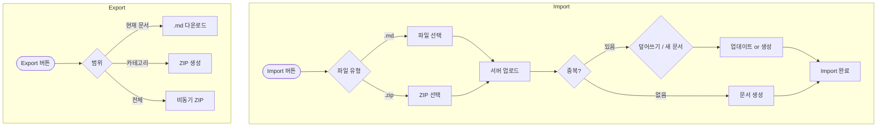

---

### UF-B7. 버전 히스토리 복원

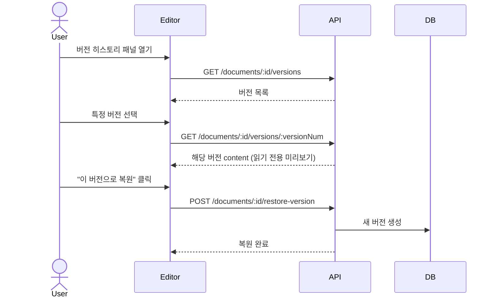

---

### UF-B8. 문서 링크 연결 (v1.2.0 — DAG 내비게이션)

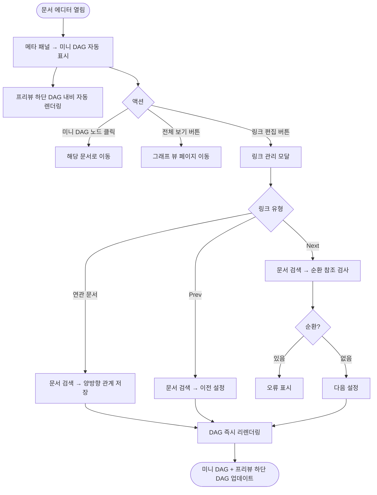

---

### UF-B9. Embed 연동 플로우

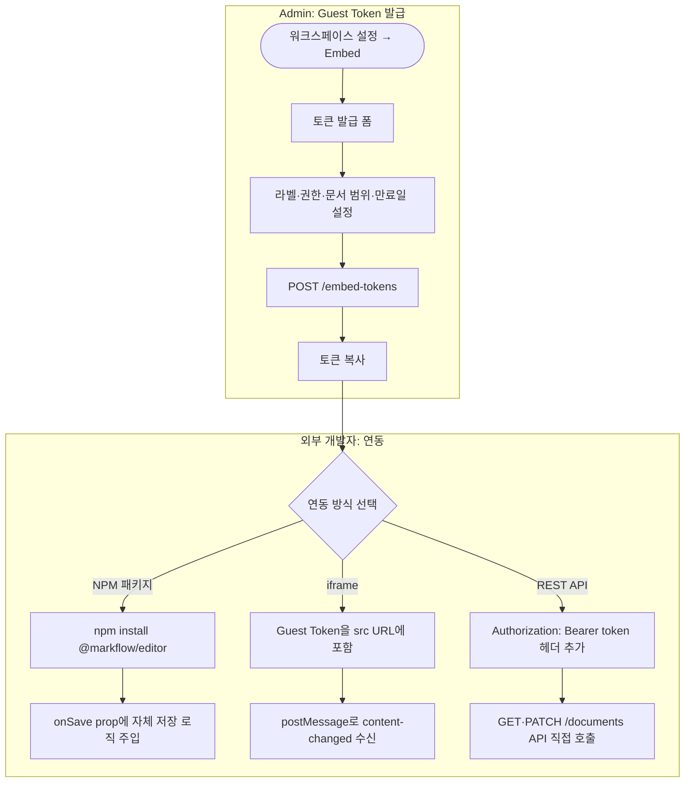

---

### UF-B10. 폴더(카테고리) 관리 `P0` 🚧 (신규)

```mermaid
flowchart TD
    subgraph CREATE [폴더 생성]
        A1([사이드바 📁 버튼]) --> M1[새 폴더 모달]
        A2([컨텍스트 메뉴 → 하위 폴더]) --> M1
        M1 --> N1[폴더 이름 입력]
        N1 --> N2[경로 미리보기 실시간 갱신]
        N2 --> N3{상위 위치 선택}
        N3 -- 루트 --> N4[루트에 생성]
        N3 -- 기존 폴더 --> N5[하위에 생성]
        N4 & N5 --> N6[사이드바에 즉시 추가]
    end

    subgraph RENAME [이름 변경]
        B1([폴더 항목 우클릭 or ⋯]) --> CM[컨텍스트 메뉴]
        CM --> B2[이름 변경 선택]
        B2 --> B3[이름 변경 모달]
        B3 --> B4[새 이름 입력 → 확인]
        B4 --> B5[사이드바 DOM 즉시 업데이트]
    end

    subgraph DELETE [폴더 삭제]
        C1([컨텍스트 메뉴 → 폴더 삭제]) --> D1[삭제 확인 모달]
        D1 --> D2[폴더 이름 재입력 확인]
        D2 --> D3{일치?}
        D3 -- 불일치 --> D4[오류 토스트]
        D3 -- 일치 --> D5[폴더 제거 + 하위 문서 루트 이동]
    end

    subgraph NEWDOC [폴더 내 문서 생성]
        E1([컨텍스트 메뉴 → 새 문서 추가]) --> F1[새 문서 모달]
        F1 --> F2[해당 폴더 기본값으로 설정됨]
        F2 --> F3[제목 입력 → 만들고 편집 →]
        F3 --> F4[에디터 열림]
    end
```

---

### UF-B11. 그래프 뷰 탐색 `P1` 🚧 (신규)

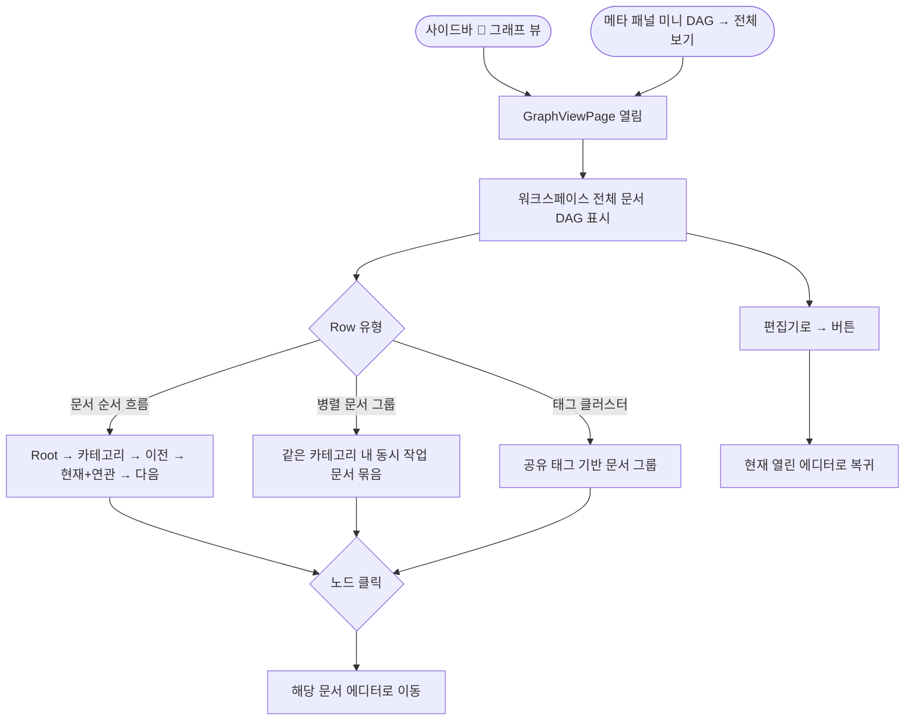
