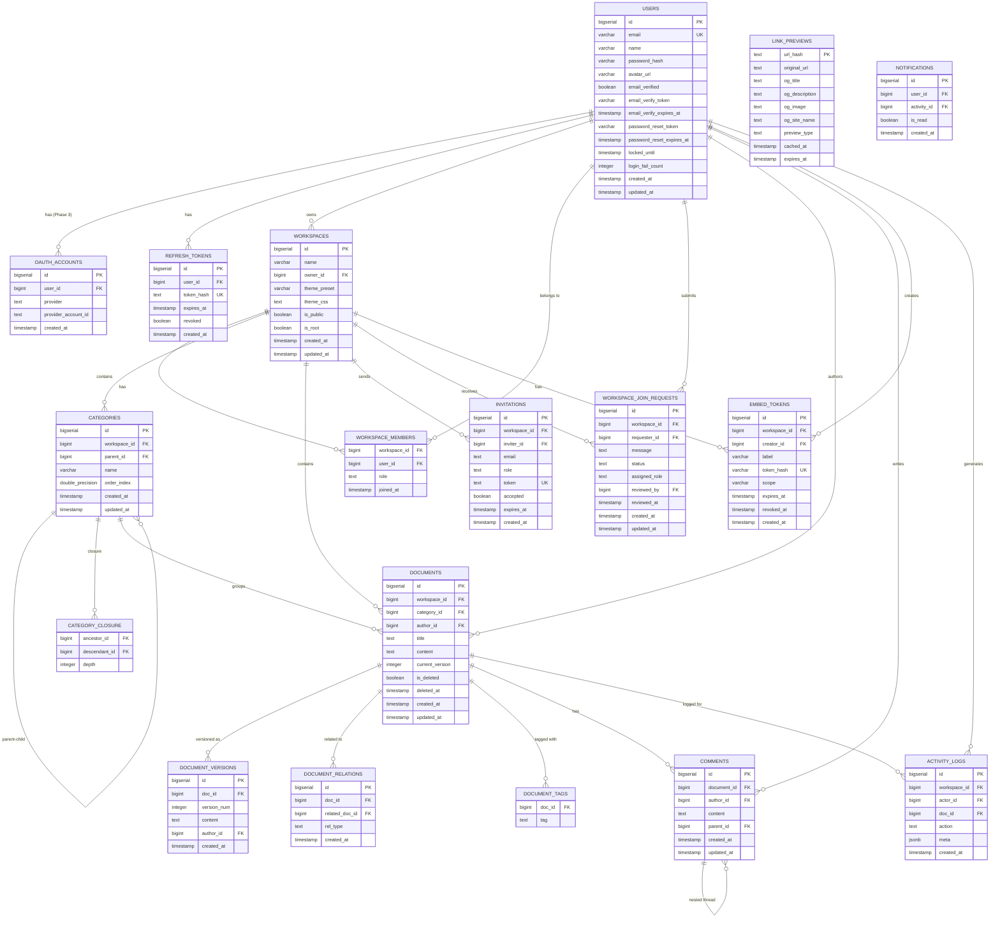

# 004 — 데이터 모델 (Data Model & ERD)

> **버전:** 1.4.0
> **최종 수정:** 2026-04-07
> **DB:** PostgreSQL 16 · **ORM:** Drizzle ORM
> **상태:** 📋 계획됨 (KMS SaaS 구축 시 적용)
> **변경 이력:**
> - v1.4.0 — USERS 테이블: password_reset_token/password_reset_expires_at 추가, email_verify_token/email_verify_expires_at/locked_until/login_fail_count 반영. WORKSPACES: UNIQUE(name) → UNIQUE(owner_id, name) 복합 유니크로 변경, description 제거. DOCUMENTS: slug 컬럼 제거(마이그레이션 0001). CATEGORIES: slug 제거. 마이그레이션 0002 추가
> - v1.3.0 — 실제 구현 기준 스키마 동기화: ID 타입 uuid→bigserial 전체 교체, OAUTH_ACCOUNTS Phase 3 이연, workspaces 테이블 slug 제거 및 theme_preset/theme_css 추가, categories.order_index 추가, document_versions.author_id 추가, comments/embed_tokens 테이블 상세화, 인덱스 전략 반영
> - v1.2.0 — `CATEGORY_CLOSURE` 테이블 신규 추가 (무제한 중첩 계층 조회 최적화), `DOCUMENT_RELATIONS`에 DAG 관련 무결성 규칙 보강, 마이그레이션 파일 `0012` 추가
> - v1.1.0 — `WORKSPACE_JOIN_REQUESTS` 테이블 신규 추가, ERD 관계 업데이트

---

## 1. 전체 ERD

> **테이블 수:** 17개 (comments, embed_tokens 포함)
> **ERD.svg:** v1.3 기준으로 업데이트됨



---

## 2. 테이블 상세 DDL

### 2.1 users

```sql
CREATE TABLE users (
    id                        BIGSERIAL    PRIMARY KEY,
    email                     VARCHAR(255) NOT NULL UNIQUE,
    name                      VARCHAR(100) NOT NULL,
    password_hash             VARCHAR(255) NOT NULL,
    avatar_url                VARCHAR(500),
    email_verified            BOOLEAN      NOT NULL DEFAULT FALSE,
    email_verify_token        VARCHAR(255),
    email_verify_expires_at   TIMESTAMPTZ,
    password_reset_token      VARCHAR(255),
    password_reset_expires_at TIMESTAMPTZ,
    locked_until              TIMESTAMPTZ,
    login_fail_count          INTEGER      NOT NULL DEFAULT 0,
    created_at                TIMESTAMPTZ  NOT NULL DEFAULT NOW(),
    updated_at                TIMESTAMPTZ  NOT NULL DEFAULT NOW()
);

CREATE INDEX idx_users_email ON users(email);
```

### 2.2 oauth_accounts (Phase 3 예정 — 현재 미구현)

> **참고:** OAuth 소셜 로그인은 Phase 3에서 구현 예정이다. 현재 Phase 1에서는 이메일/비밀번호 인증만 지원하며, 이 테이블은 스키마에 생성되지 않는다. Phase 3 구현 시 아래 DDL을 기반으로 마이그레이션을 작성한다.

```sql
-- Phase 3 예정 — 현재 미구현
CREATE TABLE oauth_accounts (
    id                  BIGSERIAL   PRIMARY KEY,
    user_id             BIGINT      NOT NULL REFERENCES users(id) ON DELETE CASCADE,
    provider            TEXT        NOT NULL,  -- 'google', 'github', etc.
    provider_account_id TEXT        NOT NULL,
    created_at          TIMESTAMPTZ NOT NULL DEFAULT NOW(),
    UNIQUE (provider, provider_account_id)
);

CREATE INDEX idx_oauth_user ON oauth_accounts(user_id);
```

### 2.3 refresh_tokens

```sql
CREATE TABLE refresh_tokens (
    id          BIGSERIAL   PRIMARY KEY,
    user_id     BIGINT      NOT NULL REFERENCES users(id) ON DELETE CASCADE,
    token_hash  TEXT        NOT NULL UNIQUE,
    expires_at  TIMESTAMPTZ NOT NULL,
    revoked     BOOLEAN     NOT NULL DEFAULT FALSE,
    created_at  TIMESTAMPTZ NOT NULL DEFAULT NOW()
);

CREATE INDEX idx_refresh_user    ON refresh_tokens(user_id);
CREATE INDEX idx_refresh_expires ON refresh_tokens(expires_at);
```

### 2.4 workspaces

```sql
CREATE TABLE workspaces (
    id            BIGSERIAL    PRIMARY KEY,
    name          TEXT         NOT NULL UNIQUE CHECK (char_length(name) BETWEEN 2 AND 50),
    description   TEXT,
    owner_id      BIGINT       NOT NULL REFERENCES users(id) ON DELETE RESTRICT,
    theme_preset  VARCHAR(20)  NOT NULL DEFAULT 'default',  -- 테마 프리셋 식별자
    theme_css     TEXT         NOT NULL DEFAULT '',          -- 커스텀 CSS 오버라이드
    is_public     BOOLEAN      NOT NULL DEFAULT FALSE,
    -- Root 워크스페이스 여부. 회원가입 시 자동 생성되는 개인 워크스페이스.
    -- name = 'My Notes', is_root = TRUE
    is_root       BOOLEAN      NOT NULL DEFAULT FALSE,
    created_at    TIMESTAMPTZ  NOT NULL DEFAULT NOW(),
    updated_at    TIMESTAMPTZ  NOT NULL DEFAULT NOW()
);

CREATE INDEX idx_workspaces_owner  ON workspaces(owner_id);
CREATE INDEX idx_workspaces_name   ON workspaces(name);
CREATE INDEX idx_workspaces_public ON workspaces(is_public) WHERE is_public = TRUE;
```

> **v1.3.0 변경:** `slug` 컬럼 제거 — 실제 구현에서는 `name`이 UNIQUE이며 URL 식별자로 사용된다. `theme_preset` 컬럼 추가 (테마 프리셋 식별자), `theme_css`를 `NOT NULL DEFAULT ''`로 변경.

> **Root 워크스페이스 생성 규칙:** 회원가입 완료(이메일 인증 후) 시점에 서버가 자동으로 `is_root = TRUE` 워크스페이스를 1개 생성한다. `name`은 UNIQUE이며 URL에 사용된다. 사용자는 이 워크스페이스를 삭제할 수 없고, 이름은 변경 가능하다.

### 2.5 workspace_members

```sql
CREATE TYPE workspace_role AS ENUM ('owner', 'admin', 'editor', 'viewer');

CREATE TABLE workspace_members (
    workspace_id  BIGINT          NOT NULL REFERENCES workspaces(id) ON DELETE CASCADE,
    user_id       BIGINT          NOT NULL REFERENCES users(id) ON DELETE CASCADE,
    role          workspace_role  NOT NULL DEFAULT 'editor',
    joined_at     TIMESTAMPTZ     NOT NULL DEFAULT NOW(),
    PRIMARY KEY (workspace_id, user_id)
);

CREATE INDEX idx_wm_user_id      ON workspace_members(user_id);
CREATE INDEX idx_wm_workspace_id ON workspace_members(workspace_id);
```

### 2.6 invitations

```sql
CREATE TABLE invitations (
    id            BIGSERIAL       PRIMARY KEY,
    workspace_id  BIGINT          NOT NULL REFERENCES workspaces(id) ON DELETE CASCADE,
    inviter_id    BIGINT          NOT NULL REFERENCES users(id) ON DELETE CASCADE,
    email         TEXT            NOT NULL,
    role          workspace_role  NOT NULL DEFAULT 'editor',
    token         TEXT            NOT NULL UNIQUE DEFAULT encode(gen_random_bytes(32), 'hex'),
    accepted      BOOLEAN         NOT NULL DEFAULT FALSE,
    expires_at    TIMESTAMPTZ     NOT NULL DEFAULT NOW() + INTERVAL '72 hours',
    created_at    TIMESTAMPTZ     NOT NULL DEFAULT NOW()
);

CREATE INDEX idx_inv_workspace ON invitations(workspace_id);
CREATE INDEX idx_inv_token     ON invitations(token);
CREATE INDEX idx_inv_email     ON invitations(email);
```

### 2.7 workspace_join_requests (v1.1.0)

> 비멤버 사용자가 공개 워크스페이스에 가입 신청을 제출하는 엔티티.  
> Admin/Owner가 신청을 검토하여 승인 또는 거절한다.

```sql
CREATE TYPE join_request_status AS ENUM ('pending', 'approved', 'rejected');

CREATE TABLE workspace_join_requests (
    id             BIGSERIAL            PRIMARY KEY,
    workspace_id   BIGINT               NOT NULL REFERENCES workspaces(id) ON DELETE CASCADE,
    requester_id   BIGINT               NOT NULL REFERENCES users(id) ON DELETE CASCADE,
    message        TEXT                 CHECK (char_length(message) <= 500),  -- 신청 메시지 (선택)
    status         join_request_status  NOT NULL DEFAULT 'pending',
    assigned_role  workspace_role,      -- 승인 시 부여할 역할 (NULL until approved)
    reviewed_by    BIGINT               REFERENCES users(id) ON DELETE SET NULL,
    reviewed_at    TIMESTAMPTZ,
    created_at     TIMESTAMPTZ          NOT NULL DEFAULT NOW(),
    updated_at     TIMESTAMPTZ          NOT NULL DEFAULT NOW(),
    UNIQUE (workspace_id, requester_id)  -- 동일 워크스페이스에 중복 신청 불가
);

CREATE INDEX idx_jreq_workspace_status ON workspace_join_requests(workspace_id, status);
CREATE INDEX idx_jreq_requester        ON workspace_join_requests(requester_id);
```

> **v1.3.0 인덱스 추가:** `idx_join_requests_unique_pending` — pending 상태에 대한 partial unique index로 동일 워크스페이스-사용자 조합에 pending 신청이 1건만 존재하도록 보장.

```sql
CREATE UNIQUE INDEX idx_join_requests_unique_pending
    ON workspace_join_requests(workspace_id, requester_id)
    WHERE status = 'pending';
```

**비즈니스 규칙**

| 규칙 | 설명 |
|------|------|
| 신청 가능 조건 | `workspaces.is_public = TRUE` 이고 신청자가 아직 멤버가 아닐 것 |
| 중복 신청 | UNIQUE 제약으로 차단. `409 CONFLICT` 반환 |
| 승인 처리 | `status = 'approved'` + `workspace_members` INSERT + `reviewed_by`, `reviewed_at` 기록 |
| 거절 처리 | `status = 'rejected'` + `reviewed_by`, `reviewed_at` 기록 |
| 재신청 | 거절된 경우 기존 레코드 UPDATE 또는 신규 INSERT (구현 선택) |
| 알림 | 승인/거절 시 신청자에게 이메일 알림 발송 (Resend) |

**API 엔드포인트**

```
POST   /workspaces/:id/join-requests          신청 제출 (requester)
GET    /workspaces/:id/join-requests          신청 목록 조회 (admin+, ?status=pending)
PATCH  /workspaces/:id/join-requests/:reqId   승인/거절 처리 (admin+)
DELETE /workspaces/:id/join-requests/:reqId   신청 취소 (requester 본인)
GET    /me/join-requests                      내 신청 현황 조회 (requester)
```

### 2.8 categories

```sql
CREATE TABLE categories (
    id            BIGSERIAL        PRIMARY KEY,
    workspace_id  BIGINT           NOT NULL REFERENCES workspaces(id) ON DELETE CASCADE,
    parent_id     BIGINT           REFERENCES categories(id) ON DELETE SET NULL,
    name          TEXT             NOT NULL CHECK (char_length(name) BETWEEN 1 AND 100),
    order_index   DOUBLE PRECISION NOT NULL DEFAULT 0,  -- Fractional Indexing
    created_at    TIMESTAMPTZ      NOT NULL DEFAULT NOW(),
    updated_at    TIMESTAMPTZ      NOT NULL DEFAULT NOW(),
    UNIQUE NULLS NOT DISTINCT (workspace_id, parent_id, name)
);

CREATE INDEX idx_categories_workspace ON categories(workspace_id);
CREATE INDEX idx_categories_parent    ON categories(parent_id);
```

> **v1.3.0 변경:** `order_index` 타입이 `REAL`에서 `DOUBLE PRECISION`으로 변경되어 Fractional Indexing의 정밀도가 향상되었다. UQ 제약에 `NULLS NOT DISTINCT` 추가 — `parent_id`가 NULL인 루트 카테고리에서도 동일 이름 중복을 방지한다.

> **설계 메모:** `order_index`는 Fractional Indexing 방식. 재정렬 시 전체 레코드 업데이트 없이 중간값 삽입. 정밀도 부족 시 전체 재인덱싱.

### 2.8a category_closure (v1.2.0)

무제한 중첩 폴더의 계층 관계를 빠르게 조회하기 위한 Closure Table.

```sql
CREATE TABLE category_closure (
    ancestor_id   BIGINT  NOT NULL REFERENCES categories(id) ON DELETE CASCADE,
    descendant_id BIGINT  NOT NULL REFERENCES categories(id) ON DELETE CASCADE,
    depth         INTEGER NOT NULL,  -- 0 = 자기 자신
    PRIMARY KEY (ancestor_id, descendant_id)
);

CREATE INDEX idx_closure_ancestor   ON category_closure(ancestor_id);
CREATE INDEX idx_closure_descendant ON category_closure(descendant_id);
```

**활용 쿼리 예시**

```sql
-- 특정 카테고리의 모든 하위 계층 조회 (재귀 없이 O(1))
SELECT c.*
FROM categories c
JOIN category_closure cc ON cc.descendant_id = c.id
WHERE cc.ancestor_id = :categoryId AND cc.depth > 0;

-- 특정 카테고리의 전체 상위 경로(breadcrumb) 조회
SELECT c.*
FROM categories c
JOIN category_closure cc ON cc.ancestor_id = c.id
WHERE cc.descendant_id = :categoryId
ORDER BY cc.depth DESC;
```

> **삽입 트리거:** 카테고리 생성 시 앱 레이어 또는 DB 트리거에서 closure 행 일괄 삽입.  
> **삭제 트리거:** `ON DELETE CASCADE`로 자동 정리.  
> **이동 처리:** 부모 변경 시 기존 closure 행 삭제 후 재삽입 (트랜잭션 내 처리).

### 2.9 documents

```sql
CREATE TABLE documents (
    id               BIGSERIAL   PRIMARY KEY,
    workspace_id     BIGINT      NOT NULL REFERENCES workspaces(id) ON DELETE CASCADE,
    category_id      BIGINT      REFERENCES categories(id) ON DELETE SET NULL,
    author_id        BIGINT      NOT NULL REFERENCES users(id) ON DELETE RESTRICT,
    title            TEXT        NOT NULL DEFAULT 'Untitled',
    content          TEXT        NOT NULL DEFAULT '',
    current_version  INTEGER     NOT NULL DEFAULT 1,
    is_deleted       BOOLEAN     NOT NULL DEFAULT FALSE,
    deleted_at       TIMESTAMPTZ,
    created_at       TIMESTAMPTZ NOT NULL DEFAULT NOW(),
    updated_at       TIMESTAMPTZ NOT NULL DEFAULT NOW(),
);

-- Full-Text Search Index (simple: 한국어·영어 공용)
CREATE EXTENSION IF NOT EXISTS pg_trgm;

CREATE INDEX idx_doc_fts ON documents
    USING gin(to_tsvector('simple', coalesce(title,'') || ' ' || coalesce(content,'')));

-- Trigram Index (부분 일치·한국어 검색 보완)
CREATE INDEX idx_doc_trgm_title   ON documents USING gin(title   gin_trgm_ops);
CREATE INDEX idx_doc_trgm_content ON documents USING gin(content gin_trgm_ops);

-- 활성 문서 조회 최적화
CREATE INDEX idx_documents_active ON documents(workspace_id, category_id, updated_at DESC)
    WHERE NOT is_deleted;

-- 삭제된 문서 조회 (휴지통)
CREATE INDEX idx_documents_deleted ON documents(workspace_id, deleted_at)
    WHERE is_deleted;

```

> **v1.4.0 변경:** `start_mode` 컬럼은 v1.2.0에서 기획되었으나 프론트엔드에서 레이아웃 상태로 처리하기로 결정하여 스펙에서 완전 제거한다. `slug` 컬럼은 마이그레이션 0001에서 DROP 완료. 인덱스 이름을 실제 구현에 맞게 `idx_documents_active`, `idx_documents_deleted`로 변경하고 조건식을 `WHERE NOT is_deleted` / `WHERE is_deleted`로 통일했다.

### 2.10 document_versions

```sql
CREATE TABLE document_versions (
    id          BIGSERIAL   PRIMARY KEY,
    doc_id      BIGINT      NOT NULL REFERENCES documents(id) ON DELETE CASCADE,
    version_num INTEGER     NOT NULL,
    content     TEXT        NOT NULL,
    author_id   BIGINT      REFERENCES users(id) ON DELETE SET NULL,  -- 버전 생성자 (nullable)
    created_at  TIMESTAMPTZ NOT NULL DEFAULT NOW(),
    UNIQUE (doc_id, version_num)
);

CREATE UNIQUE INDEX uq_document_version ON document_versions(document_id, version);
CREATE INDEX idx_dv_doc_id ON document_versions(doc_id, version_num DESC);
```

> **v1.3.0 변경:** `author_id`를 nullable FK로 변경 (`ON DELETE SET NULL`). 사용자 삭제 시에도 버전 히스토리가 보존되어야 하므로 `RESTRICT` 대신 `SET NULL`을 사용한다.

### 2.11 document_relations

```sql
CREATE TYPE relation_type AS ENUM ('related', 'prev', 'next');

CREATE TABLE document_relations (
    id             BIGSERIAL     PRIMARY KEY,
    doc_id         BIGINT        NOT NULL REFERENCES documents(id) ON DELETE CASCADE,
    related_doc_id BIGINT        NOT NULL REFERENCES documents(id) ON DELETE CASCADE,
    rel_type       relation_type NOT NULL,
    created_at     TIMESTAMPTZ   NOT NULL DEFAULT NOW(),
    UNIQUE (doc_id, related_doc_id, rel_type)
);

-- 연관 문서 최대 20개 제한 (rel_type='related' 기준)
-- 애플리케이션 레이어에서 INSERT 전 COUNT 검사로 적용

CREATE INDEX idx_document_relations_source ON document_relations(doc_id);
CREATE INDEX idx_document_relations_target ON document_relations(related_doc_id);
```

> **v1.3.0 변경:** 인덱스 이름을 `idx_document_relations_source`, `idx_document_relations_target`으로 변경하여 실제 구현과 동기화.

### 2.12 document_tags

```sql
CREATE TABLE document_tags (
    doc_id  BIGINT  NOT NULL REFERENCES documents(id) ON DELETE CASCADE,
    tag     TEXT    NOT NULL CHECK (char_length(tag) BETWEEN 1 AND 50),
    PRIMARY KEY (doc_id, tag)
);

CREATE INDEX idx_document_tags_document ON document_tags(doc_id);
CREATE INDEX idx_document_tags_tag      ON document_tags(tag);
```

> **v1.3.0 변경:** 인덱스 `idx_document_tags_document`, `idx_document_tags_tag` 추가. 태그 기반 문서 검색 및 문서별 태그 조회 최적화.

### 2.13 link_previews

```sql
CREATE TYPE preview_type AS ENUM ('website', 'video', 'internal');

CREATE TABLE link_previews (
    url_hash        TEXT         PRIMARY KEY,  -- SHA-256(original_url)
    original_url    TEXT         NOT NULL,
    og_title        TEXT,
    og_description  TEXT,
    og_image        TEXT,
    og_site_name    TEXT,
    preview_type    preview_type NOT NULL DEFAULT 'website',
    cached_at       TIMESTAMPTZ  NOT NULL DEFAULT NOW(),
    expires_at      TIMESTAMPTZ  NOT NULL
);

CREATE INDEX idx_lp_expires ON link_previews(expires_at);
```

### 2.14 comments

```sql
CREATE TABLE comments (
    id           BIGSERIAL   PRIMARY KEY,
    document_id  BIGINT      NOT NULL REFERENCES documents(id) ON DELETE CASCADE,
    author_id    BIGINT      NOT NULL REFERENCES users(id) ON DELETE CASCADE,
    content      TEXT        NOT NULL CHECK (char_length(content) BETWEEN 1 AND 5000),
    parent_id    BIGINT      REFERENCES comments(id) ON DELETE CASCADE,  -- self-ref, nullable (nested threads)
    created_at   TIMESTAMPTZ NOT NULL DEFAULT NOW(),
    updated_at   TIMESTAMPTZ NOT NULL DEFAULT NOW()
);

CREATE INDEX idx_comments_document ON comments(document_id);
```

> **v1.3.0 변경:** FK 컬럼명을 `doc_id`에서 `document_id`로 변경하여 실제 구현과 동기화. `selection`, `resolved` 컬럼 제거 (현재 미구현). `parent_id`로 중첩 댓글(nested threads) 지원. 인덱스 이름을 `idx_comments_document`로 변경.

### 2.15 embed_tokens (v1.3.0)

> 워크스페이스 문서를 외부에 임베드할 때 사용하는 토큰 관리 테이블.  
> 토큰은 해시된 상태로 저장되며, 만료 및 폐기(revoke) 처리를 지원한다.

```sql
CREATE TABLE embed_tokens (
    id            BIGSERIAL    PRIMARY KEY,
    workspace_id  BIGINT       NOT NULL REFERENCES workspaces(id) ON DELETE CASCADE,
    creator_id    BIGINT       NOT NULL REFERENCES users(id) ON DELETE CASCADE,
    label         VARCHAR(100) NOT NULL,                       -- 토큰 식별용 라벨
    token_hash    VARCHAR(255) NOT NULL UNIQUE,                -- SHA-256 해시된 토큰
    scope         VARCHAR(20)  NOT NULL CHECK (scope IN ('read', 'read_write')),  -- 권한 범위
    expires_at    TIMESTAMPTZ  NOT NULL,                       -- 만료 시각
    revoked_at    TIMESTAMPTZ,                                 -- 폐기 시각 (NULL = 활성)
    created_at    TIMESTAMPTZ  NOT NULL DEFAULT NOW()
);

CREATE INDEX idx_embed_tokens_workspace ON embed_tokens(workspace_id);
```

**비즈니스 규칙**

| 규칙 | 설명 |
|------|------|
| 토큰 생성 권한 | Admin 이상만 생성 가능 |
| 토큰 검증 | `token_hash` 매칭 + `expires_at > NOW()` + `revoked_at IS NULL` |
| 폐기 처리 | `revoked_at = NOW()` 업데이트 (삭제하지 않음 — 감사 추적용) |
| scope 제한 | `read`: 문서 조회만 / `read_write`: 조회 + 편집 |

### 2.16 activity_logs & notifications (Phase 3 사전 설계)

```sql
CREATE TYPE activity_action AS ENUM (
    'doc_created', 'doc_updated', 'doc_deleted', 'doc_restored',
    'member_invited', 'member_joined', 'member_removed',
    'join_request_submitted', 'join_request_approved', 'join_request_rejected',
    'comment_created', 'comment_resolved'
);

CREATE TABLE activity_logs (
    id            BIGSERIAL       PRIMARY KEY,
    workspace_id  BIGINT          NOT NULL REFERENCES workspaces(id) ON DELETE CASCADE,
    actor_id      BIGINT          NOT NULL REFERENCES users(id) ON DELETE CASCADE,
    doc_id        BIGINT          REFERENCES documents(id) ON DELETE SET NULL,
    action        activity_action NOT NULL,
    meta          JSONB           DEFAULT '{}',
    created_at    TIMESTAMPTZ     NOT NULL DEFAULT NOW()
);

CREATE INDEX idx_activity_ws    ON activity_logs(workspace_id, created_at DESC);
CREATE INDEX idx_activity_actor ON activity_logs(actor_id);

CREATE TABLE notifications (
    id           BIGSERIAL   PRIMARY KEY,
    user_id      BIGINT      NOT NULL REFERENCES users(id) ON DELETE CASCADE,
    activity_id  BIGINT      NOT NULL REFERENCES activity_logs(id) ON DELETE CASCADE,
    is_read      BOOLEAN     NOT NULL DEFAULT FALSE,
    created_at   TIMESTAMPTZ NOT NULL DEFAULT NOW()
);

CREATE INDEX idx_notif_user ON notifications(user_id, is_read, created_at DESC);
```

---

## 3. 인덱스 전략

> **총 인덱스 수:** 15개 (FTS/Trigram 제외, B-tree/partial index 기준)

| # | 인덱스 이름 | 테이블 | 컬럼 / 조건 | 용도 |
|---|------------|--------|-------------|------|
| 1 | `idx_documents_active` | documents | `(workspace_id, category_id, updated_at)` WHERE NOT is_deleted | 활성 문서 목록 조회 |
| 2 | `idx_documents_deleted` | documents | `(workspace_id, deleted_at)` WHERE is_deleted | 휴지통 문서 조회 |
| 3 | `uq_document_version` | document_versions | `(document_id, version)` UNIQUE | 문서별 버전 유일성 |
| 4 | `idx_closure_ancestor` | category_closure | `(ancestor_id)` | 하위 계층 조회 |
| 5 | `idx_closure_descendant` | category_closure | `(descendant_id)` | 상위 경로(breadcrumb) 조회 |
| 6 | `idx_comments_document` | comments | `(document_id)` | 문서별 댓글 조회 |
| 7 | `idx_embed_tokens_workspace` | embed_tokens | `(workspace_id)` | 워크스페이스별 토큰 조회 |
| 8 | `idx_refresh_user` | refresh_tokens | `(user_id)` | 사용자별 토큰 조회 |
| 9 | `idx_refresh_expires` | refresh_tokens | `(expires_at)` | 만료 토큰 정리 |
| 10 | `idx_document_tags_document` | document_tags | `(doc_id)` | 문서별 태그 조회 |
| 11 | `idx_document_tags_tag` | document_tags | `(tag)` | 태그별 문서 검색 |
| 12 | `idx_document_relations_source` | document_relations | `(doc_id)` | 소스 문서 기준 관계 조회 |
| 13 | `idx_document_relations_target` | document_relations | `(related_doc_id)` | 타겟 문서 기준 관계 조회 |
| 14 | `idx_join_requests_unique_pending` | workspace_join_requests | `(workspace_id, requester_id)` WHERE status = 'pending' | pending 중복 방지 (partial unique) |
| 15 | 기타 (`idx_users_email`, `idx_workspaces_*`, `idx_wm_*`, `idx_inv_*`, 등) | 각 테이블 | — | 기본 조회 최적화 |

---

## 4. 데이터 무결성 규칙

| 규칙 | 구현 방법 |
|------|-----------|
| 워크스페이스 Owner 최소 1명 | 애플리케이션 레이어 검증 |
| 문서 Prev/Next 순환 참조 방지 | 저장 전 그래프 순환 탐지 (DFS) — DOCUMENT_RELATIONS 단일 소스 |
| Prev/Next 관계 단일 저장 | DOCUMENT_RELATIONS만 사용, DOCUMENTS 테이블에 중복 컬럼 없음 |
| 카테고리 중첩 삭제 시 문서 보호 | `ON DELETE SET NULL` → 문서 category_id NULL (루트로 이동) |
| 카테고리 이동 순환 방지 | 자기 자신의 자손으로 이동 시 400 + CIRCULAR_CATEGORY — 앱 레이어 |
| Closure Table 정합성 | 카테고리 생성·이동·삭제 시 트랜잭션으로 closure 행 동기화 |
| 버전 최대 보관 (Phase별) | Phase 1: 20개 / Phase 2+: 100개 — 앱 레이어 또는 트리거 정리 |
| Soft Delete 후 문서 복원 | `is_deleted = FALSE`, `deleted_at = NULL`로 복원 |
| Root 워크스페이스 삭제 방지 | `is_root = TRUE` 워크스페이스 DELETE API 403 반환 |
| 연관 문서 최대 20개 | 애플리케이션 레이어 검증, `rel_type='related'` COUNT > 20 → 400 반환 |
| 가입 신청 중복 방지 | `UNIQUE (workspace_id, requester_id)` 제약 → 409 반환 |
| 가입 신청 가능 조건 | `is_public = TRUE` 이고 미멤버인 경우만 허용 — 앱 레이어 검증 |
| 공개 워크스페이스 검색 | `is_public` 인덱스 활용 — `GET /workspaces?public=true&q=keyword` |
| Embed 토큰 검증 | `token_hash` 매칭 + `expires_at > NOW()` + `revoked_at IS NULL` |

---

## 5. 마이그레이션 전략

```
migrations/
├── 0001_initial_users.sql
├── 0002_workspaces_members.sql        ← is_root 컬럼 포함
├── 0003_categories.sql
├── 0004_documents.sql
├── 0005_versions_relations.sql
├── 0006_invitations.sql
├── 0007_join_requests.sql             ← v1.1.0 신규
├── 0008_link_previews.sql
├── 0009_comments.sql
├── 0010_search_indexes.sql            ← pg_trgm + simple FTS
├── 0011_activity_notifications.sql    ← Phase 3 사전 준비
├── 0012_category_closure.sql          ← v1.2.0 Closure Table
├── 0013_embed_tokens.sql              ← v1.3.0 신규 — Embed Token 테이블
├── 0014_workspaces_theme_preset.sql   ← v1.3.0 — theme_preset 컬럼 추가
└── 0015_index_sync.sql                ← v1.3.0 — 인덱스 이름/조건 실제 구현 동기화
```

- **도구:** Drizzle ORM `drizzle-kit`
- **원칙:** 롤백 가능한 마이그레이션, `DOWN` 스크립트 필수
- **배포:** 마이그레이션은 서비스 배포 전 별도 단계에서 실행
