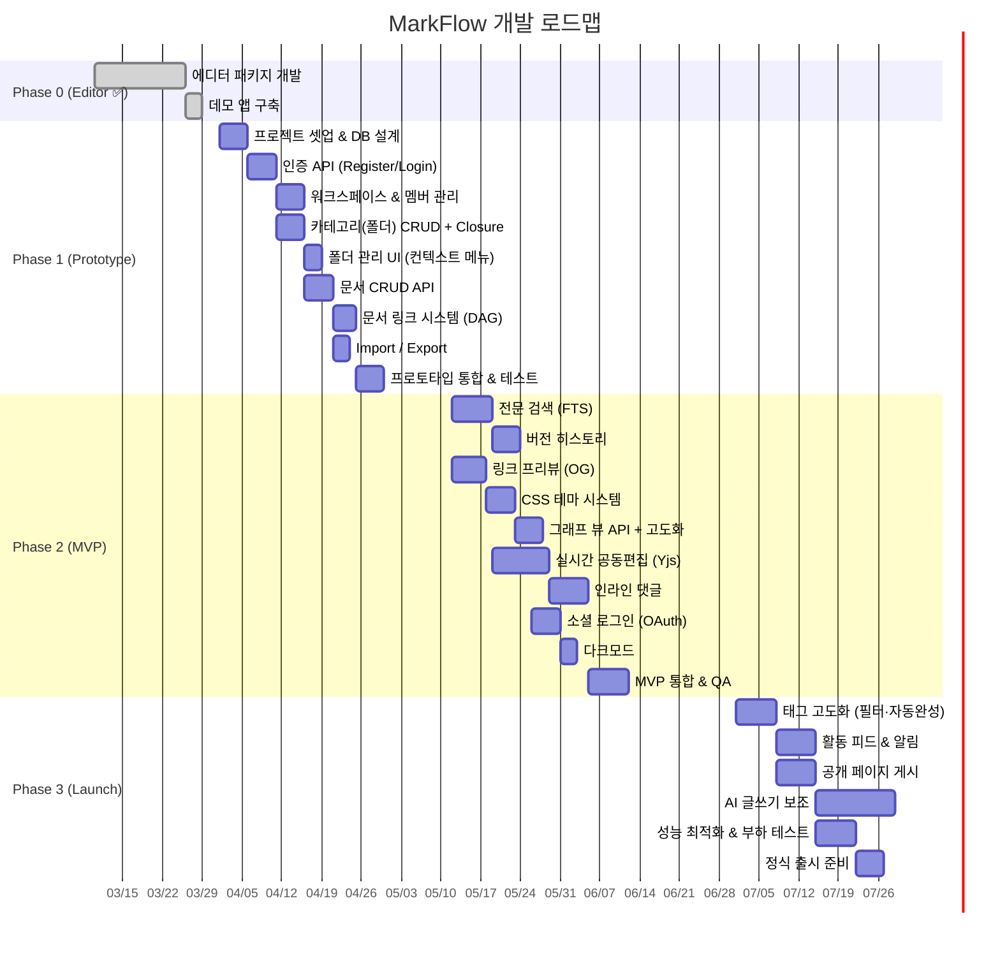
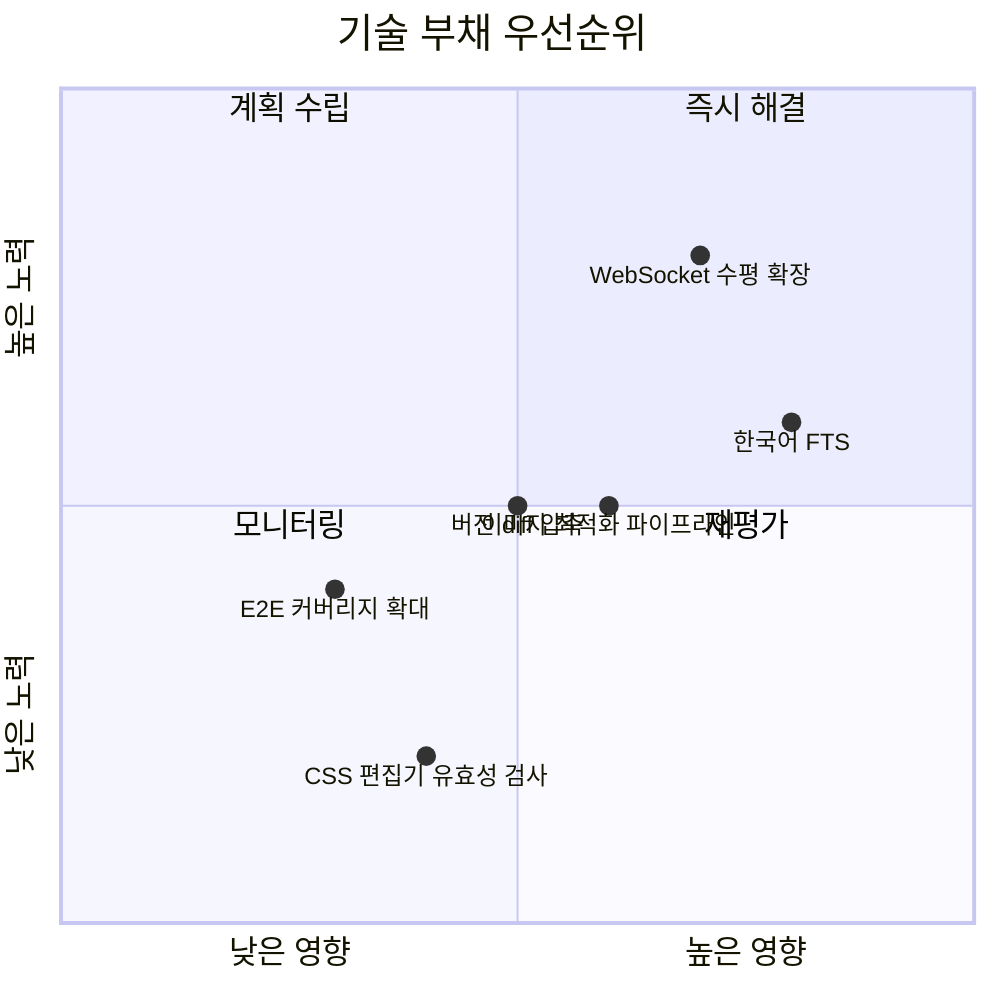

# 008 — 개발 로드맵 (Development Roadmap)

> **최종 수정:** 2026-03-26 (v1.2.0 반영)
> **변경 이력:** v1.2.0 — Phase 1 P0 체크리스트 상세화(폴더 관리 UI, DAG 그래프 뷰), Phase 2 P1 체크리스트 DAG 그래프 뷰 API 추가, Phase 3 그래프 뷰 항목 Phase 1~2로 앞당김, Gantt 차트 그래프 뷰 Task 추가

---

## 1. 전체 타임라인

---

## 2. Phase 0 — 에디터 패키지 ✅ (완료)

**목표:** 독립 배포 가능한 Markdown 에디터 컴포넌트

| 항목 | 상태 |
|------|------|
| CodeMirror 6 기반 Dual View 에디터 | ✅ |
| CommonMark 0.28 + GFM 구문 지원 | ✅ |
| 툴바 (H1~H6, B/I/S, 목록, 코드블록, 링크, 이미지, 표, HR, Math) | ✅ |
| 라이트/다크 테마 전환 | ✅ |
| 스크롤 동기화 | ✅ |
| KaTeX 수식 렌더링 | ✅ |
| 코드 구문 강조 (rehype-highlight) | ✅ |
| Cloudflare R2 이미지 업로드 | ✅ |
| ESM + CJS 번들 + CSS export | ✅ |
| Next.js App Router 호환 (`'use client'`) | ✅ |

---

## 3. Phase 1 — 프로토타입 (4~5주)

**목표:** 팀 내부에서 문서 작성·관리 가능한 수준 검증

### 마일스톤

| 주차 | 목표 | 완료 기준 |
|------|------|-----------|
| W1 | 인프라 & 인증 | 회원가입·로그인·JWT 동작, DB 마이그레이션 |
| W2 | 워크스페이스 & 폴더 | 멤버 초대, 폴더 트리 CRUD |
| W3 | 문서 관리 | 문서 CRUD, Prev/Next/연관 링크, Import/Export |
| W4 | 통합 & 안정화 | 핵심 E2E 3개 통과, 팀 내부 사용 개시 |

### P0 기능 체크리스트

- [ ] 이메일 회원가입 & 로그인 (JWT)
- [ ] 회원가입 완료 시 **Root 워크스페이스 자동 생성**
- [ ] 프로필 편집 (이름, 아바타)
- [ ] 워크스페이스 생성 & 멤버 초대 (4가지 역할)
- [ ] 초대 수락 API (`GET /invitations/:token`, `POST /invitations/:token/accept`)
- [ ] 카테고리(폴더) CRUD + Closure Table 계층 관리
- [ ] **폴더 관리 UI: 사이드바 📁/＋ 버튼, 우클릭 컨텍스트 메뉴 (생성·이름변경·삭제·하위 추가)** 🚧
- [ ] **새 문서 모달: 카테고리 선택 + 시작 방식 선택** 🚧
- [ ] 문서 자동 저장 (1초 디바운스)
- [ ] 문서 버전 스냅샷 생성 (Phase 1: 최대 20개)
- [ ] Prev / Next / 연관 링크 설정 (DOCUMENT_RELATIONS 단일 저장)
- [ ] **DAG Pipeline 내비게이션: 메타 패널 미니 DAG + 프리뷰 하단 DAG** 🚧
- [ ] **그래프 뷰 페이지 (B14): 사이드바 🔗 메뉴, 워크스페이스 전체 DAG** 🚧
- [ ] 태그 추가/삭제 (`PUT /documents/:id/tags`)
- [ ] .md Import / .md Export
- [ ] 역할 기반 권한 제어 (API + UI)

> 🚧 = 프로토타입 UI 구현 완료, 백엔드 연동 대기

### 기술 부채 허용 범위

| 항목 | Phase 1 허용 | Phase 2에서 해결 |
|------|-------------|-----------------|
| 검색 | 제목 LIKE 검색 | Full-Text Search |
| 버전 | 최대 20개 | 100개 + diff |
| 이메일 발송 | 콘솔 로그 | 실제 이메일 (Resend) |
| 에러 모니터링 | console.error | Sentry 연동 |

---

## 4. Phase 2 — MVP (6~8주 추가)

**목표:** 외부 베타 사용자 온보딩

### 마일스톤

| 주차 | 목표 | 완료 기준 |
|------|------|-----------|
| W5 | 검색 & 히스토리 | FTS 검색, 버전 복원 |
| W6-7 | 링크 프리뷰 & 테마 | OG 카드, CSS 편집기 |
| W8-9 | 실시간 협업 | 2인 동시 편집 충돌 없음 |
| W10 | 댓글 & OAuth | 인라인 댓글, Google 로그인 |
| W11-12 | QA & 베타 | 베타 10팀 온보딩 |

### P1 기능 체크리스트

- [ ] PostgreSQL Full-Text Search (한국어: pg_trgm + simple FTS)
- [ ] 버전 히스토리 100개 + 버전 간 diff (fast-diff)
- [ ] OG 링크 프리뷰 (BullMQ 비동기 처리)
- [ ] YouTube/Vimeo 임베드
- [ ] 워크스페이스 CSS 테마 편집기 + 5개 프리셋 + 동적 `<style>` 주입
- [ ] **그래프 뷰 API (`GET /graph`, `GET /dag-context`) + 실제 데이터 연동** ← Phase 3에서 앞당김
- [ ] **카테고리 이동 API (`POST .../move`) + Closure Table 동기화**
- [ ] 실시간 공동편집 (Yjs + y-websocket)
- [ ] 인라인 댓글 (스레드형)
- [ ] Google / GitHub OAuth
- [ ] ZIP Import/Export
- [ ] HTML Export (인라인 CSS) / HTML Import (Turndown 변환)
- [ ] PDF Export (서버사이드 Puppeteer)
- [ ] Embed 연동: Guest Token 발급 API + iframe embed 페이지
- [ ] Mermaid 다이어그램
- [ ] 위키링크 (`[[문서 제목]]`)

### 베타 성공 지표

| 지표 | 목표 |
|------|------|
| 베타 팀 수 | 10팀 |
| 팀당 평균 문서 수 | 20개+ |
| 주간 활성 사용자 | 팀원의 60%+ |
| NPS 점수 | 30+ |
| 치명적 버그 | 0개 |

---

## 5. Phase 3 — 정식 출시 (지속적 개발)

**목표:** 유료 플랜 런칭, 엔터프라이즈 기능

| 기능 | 분기 |
|------|------|
| 태그 고도화 (필터·자동완성·태그 관리 페이지) | Q3 2026 |
| 활동 피드 & 이메일 알림 (ACTIVITY_LOGS 기반) | Q3 2026 |
| 공개 페이지 게시 (커스텀 도메인) | Q3 2026 |
| PDF Import (pdfjs-dist 텍스트 추출, 베스트 에포트) | Q3 2026 |
| Embed NPM 패키지 고급 옵션 (onSave, onLoad 커스텀 훅) | Q3 2026 |
| AI 글쓰기 보조 (Claude API) | Q4 2026 |
| 모바일 반응형 최적화 | Q4 2026 |
| SSO / SAML | Q4 2026 |
| API 공개 (퍼블릭 API) | Q1 2027 |

### 플랜 구조 (안)

| 플랜 | 가격 | 워크스페이스 | 멤버 | 저장공간 |
|------|------|------------|------|---------|
| Free | $0 | 1개 (Root 워크스페이스 자동 생성 포함) | 5명 | 1GB |
| Team | $12/월/멤버 | 무제한 | 무제한 | 50GB |
| Enterprise | 문의 | 무제한 | 무제한 | 무제한 + SSO |

> **C4 수정:** 001 요구사항의 "사용자당 최대 10개" 규칙은 플랜 정책으로 대체됨. Free 플랜 = 1개, Team 이상 = 무제한.

---

## 6. 기술 부채 관리

---

## 7. 팀 구성 (안)

| 역할 | Phase 1 | Phase 2+ |
|------|---------|---------|
| Frontend | 2명 | 3명 |
| Backend | 2명 | 2명 |
| Fullstack (에디터) | 1명 | 1명 |
| DevOps/Infra | 0.5명 | 1명 |
| Design | 0.5명 | 1명 |
| QA | 0명 | 1명 |
| **합계** | **6명** | **9명** |
