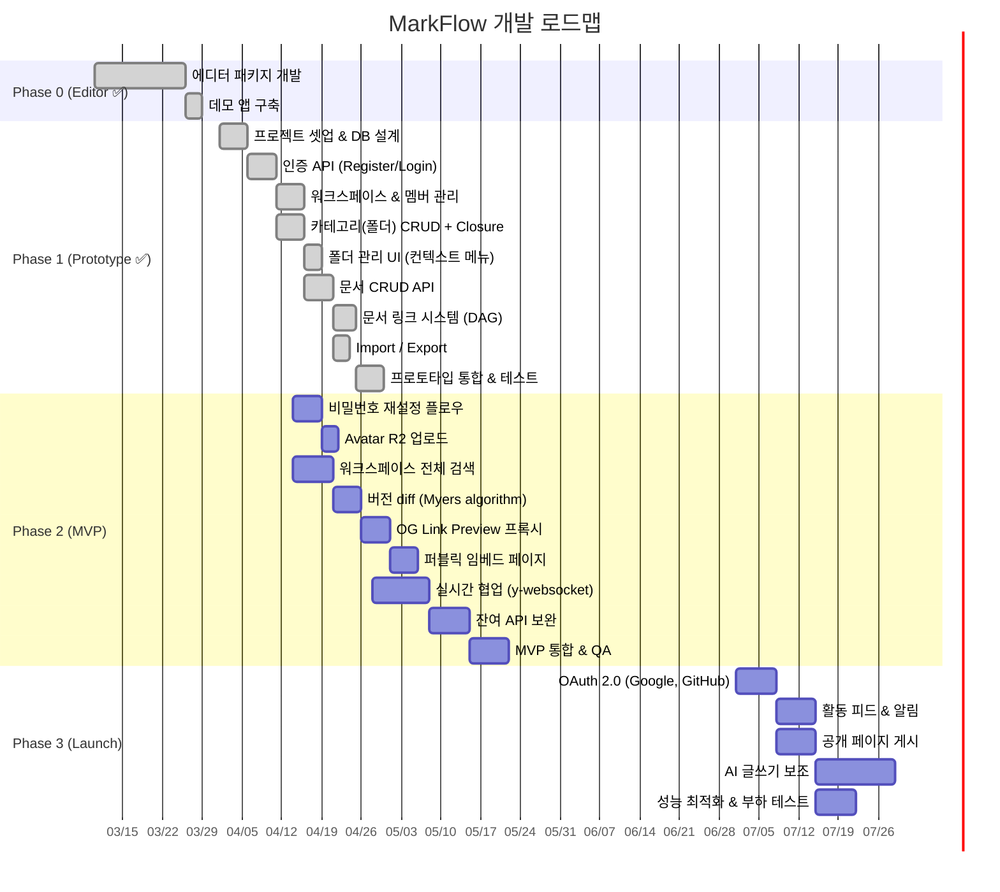
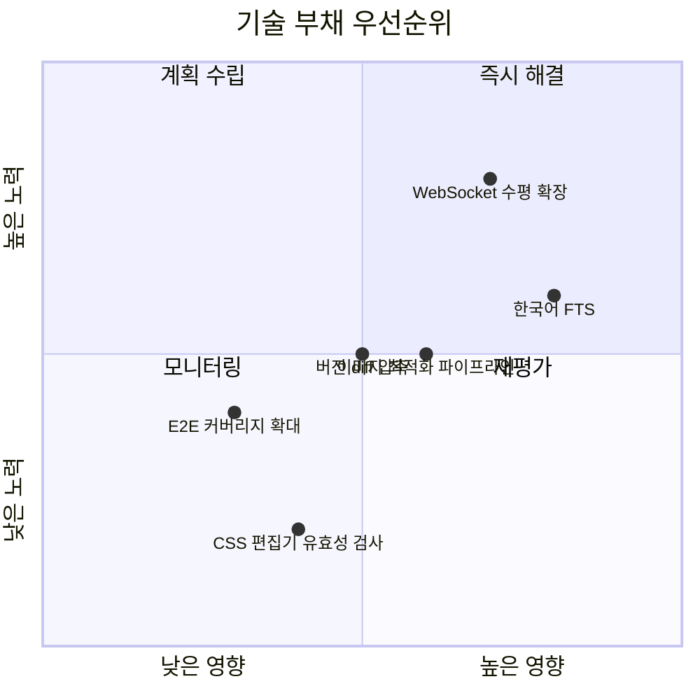

# 008 — 개발 로드맵 (Development Roadmap)

> **최종 수정:** 2026-04-04 (v1.3.0 반영)
> **변경 이력:**
> - v1.3.0 — Phase 1 Prototype 구현 완료 확인 (2026-04-04 기준), Phase 2 잔여 항목 재정리, Phase 3 OAuth 이연 명시
> - v1.2.0 — Phase 1 P0 체크리스트 상세화(폴더 관리 UI, DAG 그래프 뷰), Phase 2 P1 체크리스트 DAG 그래프 뷰 API 추가, Phase 3 그래프 뷰 항목 Phase 1~2로 앞당김, Gantt 차트 그래프 뷰 Task 추가

---

## 진행 현황 요약

| Phase | 상태 | 비고 |
|-------|------|------|
| Phase 0 (Editor) | ✅ 완료 | 독립 배포 가능한 에디터 패키지 |
| Phase 1 (Prototype) | ✅ 완료 | API 40/56 엔드포인트, 프론트엔드 14 페이지 |
| Phase 2 (MVP) | 📋 진행 예정 | 11개 항목 |
| Phase 3 (Launch) | 📋 계획 | 5개 항목 |

---

## 1. 전체 타임라인

---

## 2. Phase 0 — 에디터 패키지 ✅ (완료)

**목표:** 독립 배포 가능한 Markdown 에디터 컴포넌트

| 항목 | 상태 |
|------|------|
| CodeMirror 6 기반 Dual View 에디터 | ✅ |
| CommonMark 0.28 + GFM 구문 지원 | ✅ |
| 툴바 (H1~H6, B/I/S, 목록, 코드블록, 링크, 이미지, 표, HR, Math) | ✅ |
| 라이트/다크 테마 전환 | ✅ |
| 스크롤 동기화 | ✅ |
| KaTeX 수식 렌더링 | ✅ |
| 코드 구문 강조 (rehype-highlight) | ✅ |
| Cloudflare R2 이미지 업로드 | ✅ |
| ESM + CJS 번들 + CSS export | ✅ |
| Next.js App Router 호환 (`'use client'`) | ✅ |

---

## 3. Phase 1 — 프로토타입 ✅ (2026-04-04 완료)

**목표:** 팀 내부에서 문서 작성·관리 가능한 수준 검증

### 마일스톤

| 주차 | 목표 | 완료 기준 | 상태 |
|------|------|-----------|------|
| W1 | 인프라 & 인증 | 회원가입·로그인·JWT 동작, DB 마이그레이션 | ✅ |
| W2 | 워크스페이스 & 폴더 | 멤버 초대, 폴더 트리 CRUD | ✅ |
| W3 | 문서 관리 | 문서 CRUD, Prev/Next/연관 링크, Import/Export | ✅ |
| W4 | 통합 & 안정화 | 핵심 E2E 3개 통과, 팀 내부 사용 개시 | ✅ |

### 완료된 기능 체크리스트

**인증 & 사용자**
- [x] 이메일 회원가입 & 로그인 (JWT Access Token + Refresh Token)
- [x] 이메일 인증 (verify-email)
- [x] 계정 잠금 (5회 실패 → 15분 잠금)
- [x] 프로필 편집 (이름, 아바타)

**워크스페이스 & 멤버**
- [x] 워크스페이스 CRUD + 소유권 이전 + 공개/비공개
- [x] 멤버 관리 (초대, 역할 변경, 제거)
- [x] 가입 요청 (요청/승인/거절/일괄 처리)
- [x] RBAC 미들웨어 (owner/admin/editor/viewer)
- [x] CSRF 방어 (Origin + SameSite)

**카테고리 & 폴더**
- [x] 카테고리 CRUD + Closure Table 계층 관리
- [x] 카테고리 리오더
- [x] 폴더 UI: 사이드바 트리, 컨텍스트 메뉴, 생성 모달

**문서**
- [x] 문서 CRUD + 자동 저장 (1초 디바운스)
- [x] 문서 버전 스냅샷 생성 (최대 20개)
- [x] DAG 관계 (prev/next/related) + 그래프 뷰
- [x] 태그 시스템 (문서별, 워크스페이스별)
- [x] Import/Export (MD, HTML, ZIP)

**부가 기능**
- [x] 댓글 시스템 (생성, 삭제, 중첩 스레드)
- [x] 테마 커스텀 (프리셋 + CSS 오버라이드)
- [x] 임베드 토큰 (생성, 조회, 폐기)
- [x] 휴지통 (소프트 삭제, 복원, 영구 삭제)
- [x] 프레젠테이션 모드 (어노테이션 도구, TOC)
- [x] 검색 모달 (Cmd/Ctrl+/)

**프론트엔드 규모**
- [x] 14개 페이지, 38개 컴포넌트, 5개 Zustand 스토어

### DB 스키마

- Drizzle ORM 기반 15개 테이블 + 마이그레이션 완료

### 기술 부채 허용 범위

| 항목 | Phase 1 허용 | Phase 2에서 해결 |
|------|-------------|-----------------|
| 검색 | 제목 LIKE 검색 | 워크스페이스 전체 검색 (필터 포함) |
| 버전 | 최대 20개 | diff 비교 (Myers algorithm) |
| 이메일 발송 | 콘솔 로그 | 실제 이메일 (Resend) |
| 에러 모니터링 | console.error | Sentry 연동 |
| 비밀번호 | 로그인만 | 재설정 플로우 (forgot + reset + change) |
| Avatar | URL 직접 입력 | R2 실제 업로드 |

---

## 4. Phase 2 — MVP (6~8주 추가)

**목표:** 외부 베타 사용자 온보딩

### 마일스톤

| 주차 | 목표 | 완료 기준 |
|------|------|-----------|
| W5 | 인증 보완 & 검색 | 비밀번호 재설정, Avatar 업로드, 전체 검색 |
| W6-7 | 버전 diff & 링크 프리뷰 | Myers diff, OG 카드, 임베드 페이지 |
| W8-9 | 실시간 협업 & API 보완 | 2인 동시 편집 충돌 없음, 잔여 API |
| W10-11 | QA & 베타 | 베타 10팀 온보딩 |

### 미완료 항목 (11개)

**P1 — 핵심**
- [ ] 비밀번호 재설정 플로우 (forgot + reset + change)
- [ ] Avatar R2 실제 업로드

**P2 — 고도화**
- [ ] 워크스페이스 전체 검색 (필터: category, tag, author, date)
- [ ] 버전 diff (Myers algorithm, fast-diff)
- [ ] OG Link Preview 프록시
- [ ] 퍼블릭 임베드 페이지 (`/embed/doc/:id`)
- [ ] Category ancestors/descendants API
- [ ] 단일 문서 DAG 컨텍스트 API
- [ ] 코멘트 수정/해결 API
- [ ] 실시간 협업 (y-websocket / CRDT)
- [ ] 드래그앤드롭 폴더 이동

### 베타 성공 지표

| 지표 | 목표 |
|------|------|
| 베타 팀 수 | 10팀 |
| 팀당 평균 문서 수 | 20개+ |
| 주간 활성 사용자 | 팀원의 60%+ |
| NPS 점수 | 30+ |
| 치명적 버그 | 0개 |

---

## 5. Phase 3 — 정식 출시 (지속적 개발)

**목표:** 유료 플랜 런칭, 엔터프라이즈 기능

| 기능 | 비고 |
|------|------|
| OAuth 2.0 (Google, GitHub) + `oauth_accounts` 테이블 | Phase 2에서 이연 |
| Activity Feed (ACTIVITY_LOGS 기반 활동 피드 & 알림) | |
| Public Pages (공개 페이지 게시 + 커스텀 도메인) | |
| AI Writing Assist (Claude API 기반 글쓰기 보조) | |
| Performance Optimization (성능 최적화 & 부하 테스트) | |

### 플랜 구조 (안)

| 플랜 | 가격 | 워크스페이스 | 멤버 | 저장공간 |
|------|------|------------|------|---------|
| Free | $0 | 1개 (Root 워크스페이스 자동 생성 포함) | 5명 | 1GB |
| Team | $12/월/멤버 | 무제한 | 무제한 | 50GB |
| Enterprise | 문의 | 무제한 | 무제한 | 무제한 + SSO |

> **C4 수정:** 001 요구사항의 "사용자당 최대 10개" 규칙은 플랜 정책으로 대체됨. Free 플랜 = 1개, Team 이상 = 무제한.

---

## 6. 기술 부채 관리

---

## 7. 팀 구성 (안)

| 역할 | Phase 1 | Phase 2+ |
|------|---------|---------|
| Frontend | 2명 | 3명 |
| Backend | 2명 | 2명 |
| Fullstack (에디터) | 1명 | 1명 |
| DevOps/Infra | 0.5명 | 1명 |
| Design | 0.5명 | 1명 |
| QA | 0명 | 1명 |
| **합계** | **6명** | **9명** |
